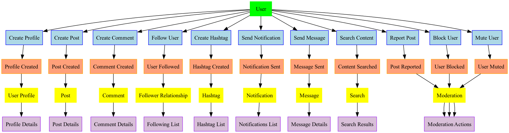
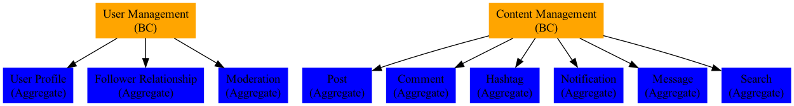
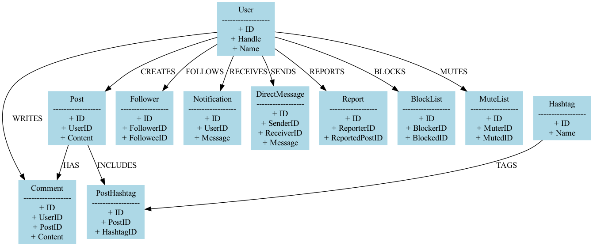

# Content Management

Working from the event-storm session we pulled out two domains: content and user.

became

Then all we had to was generate the Entity Relationship diagram

then generation the [swagger](./config/json) then building configure the [restlettes](./config/restlettes.conf) to give us a working, performant, self documenting, observable data tier.

The final step is to decide what we want the graphs to look like, which is a matter of taste / art and then create the [schema](./config/graph) and you're at the bare minimum.

You now have a series of options.

1. Do you want to generate kafka events for every domain change?
   * If so add [mongo-event-builders](https://github.com/tsmarsh/gridql/tree/main/packages/mongo-event-builder) to your docker-compose and the topics will start to form.
2. Does your data actually come from another system, not user interaction?
   * Use CDC and ksql to create a topic with data in the correct format
   * Add a [kafka-event-consumer](https://github.com/tsmarsh/gridql/tree/main/packages/kafka-event-consumer#readme) to your docker-compose and the data will start to flow in.
3. Need AuthZ?
   * Place the service behind a JWT SSO and the 'sub' will be picked up and used across the data tier to protect the data.
4. Do you need a microservice to react to changes in another microservice?
   * Write a service / function that
     1. Listens to the event from the source service
     2. Calls the graph to get the data it needs
     3. Either calls the RestAPI or writes to an input topic
5. Need to get the data back into the original data store / system of record?
  * Write a service / function that
     1. Listens to the event from the source service
     2. Calls the graph to get the data it needs
     3. Either calls the RestAPI or writes to an input topic
6. Need to get the data into your data lake?
  * Use CDC to grab the data from kafka

In all of these steps, expect to fight the urge to:
* Just put everything into a single service
* Try to optimize performance, before performance testing by assuming calls to localhost are actually the problem.
* Value throughput over observability and horizontal scalability.

